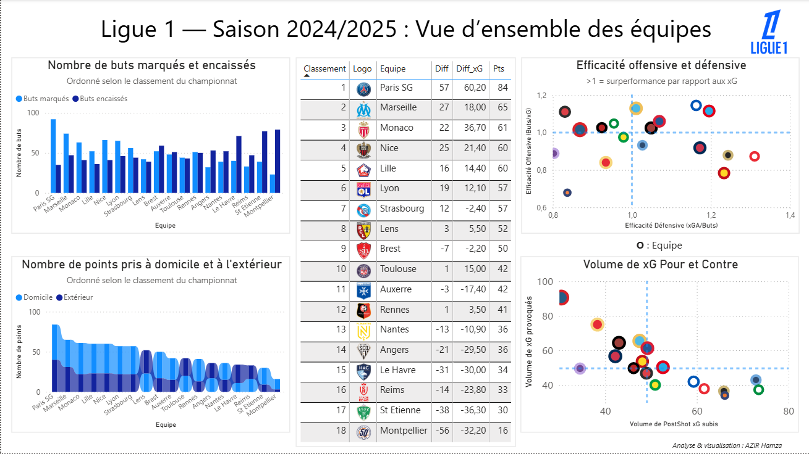
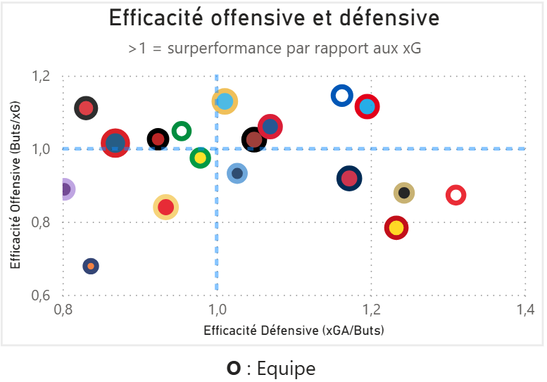
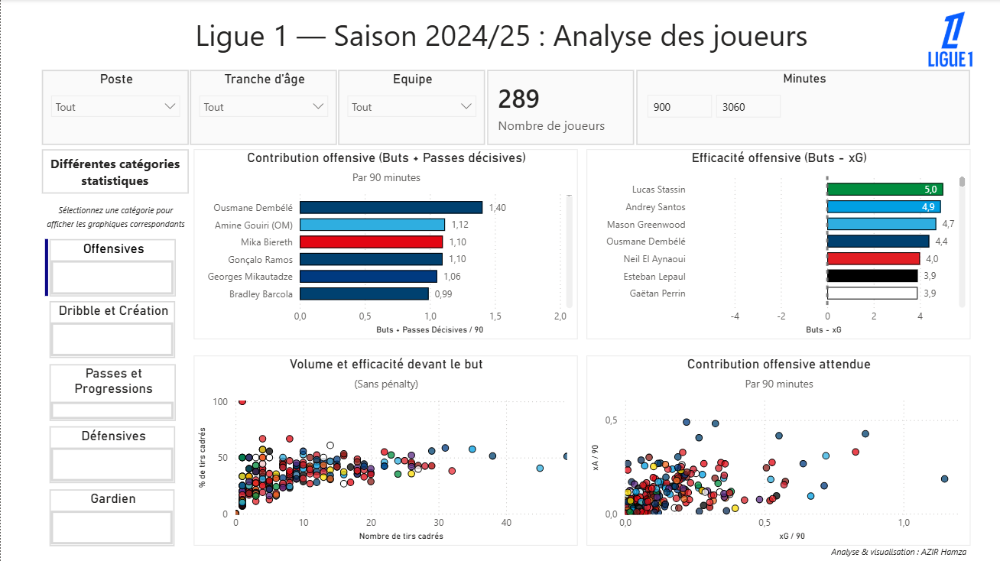
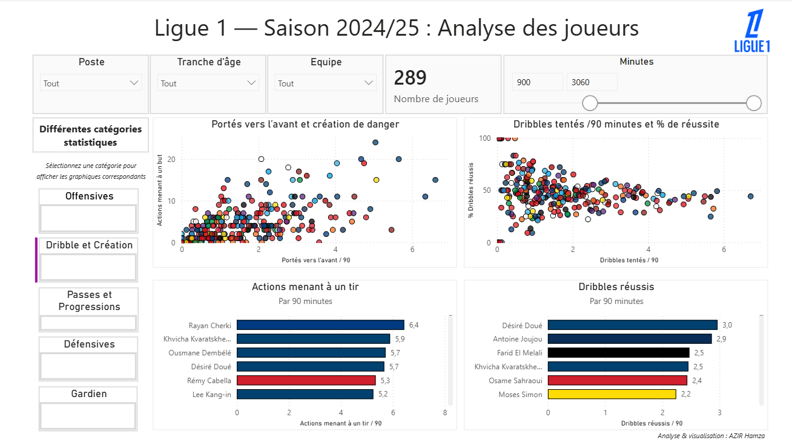

# Analyse Ligue 1 2024/2025 — Data & Visualisation

## Objectif

Analyser les performances des équipes et des joueurs de Ligue 1 à travers les statistiques avancées (xG, xA, efficacité, création de danger) afin d’identifier :

- les équipes en sur/sous-performance
- les profils de joueurs les plus impactants
- les dynamiques de jeu (création, progression, finition)

---

## Aperçu du dashboard

### Vue globale des équipes

### Insight clé — efficacité offensive & défensive

---

### Analyse des joueurs

### Focus — création & dribble

---

## Principaux enseignements

- Certaines équipes surperforment leur xG → efficacité offensive élevée
- D'autres génèrent du volume mais sous-performent → manque de réalisme
- Les joueurs les plus impactants combinent volume + efficacité + création

---

## Stack technique

- Python (Pandas, NumPy, Matplotlib)
- Jupyter Notebook
- Power BI

---

## Structure du projet
📦 ligue1-analysis
├── data/
├── notebooks/
├── dashboard/
├── images/
└── README.md

---

## Prochaines améliorations

- Ajout d’analyses prédictives
- Intégration de données multi-saisons
- Dashboard interactif web

---

## 👤 Auteur

**AZIR Hamza**
